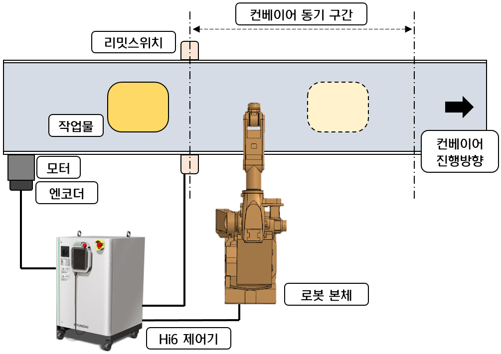

# 1.1 시스템 구성

컨베이어 동기 시스템의 일반적인 구성 형태는 아래의 그림과 같습니다.

*   <mark style="color:green;">**리밋스위치**</mark>

    작업물의 컨베이어상의 특정 위치 진입 여부와 프레스가 특정 위치를 지나가고 있음을 제어기에게 알려주는 장치입니다. 리밋스위치가 있는 위치가 위치 판단의 기준점이 됩니다.

    &#x20;
*   <mark style="color:green;">**엔코더**</mark>

    모터 구동부에는 모터의 회전량에 해당되는 펄스를 발생시키는 엔코더가 장착되어 있습니다. 엔코더는 로봇 제어기와 접속되고, 엔코더에서 출력되는 펄스가 로봇 제어기에 입력됩니다.
