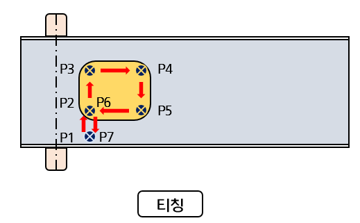
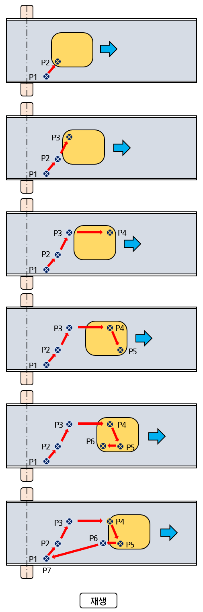

# 1.2 컨베이어 동기 원리

*   <mark style="color:green;">**티칭**</mark>

    아래의 그림과 같이 컨베이어가 정지한 상태에서 P1\~P7을 티칭한 경우를 예로 들어 살펴봅니다.

*   <mark style="color:green;">**재생**</mark>

    P2\~P6를 컨베이어 동기 구간으로 설정한 후 티칭한 궤적을 재생하는 경우, 동기 동작을 위해서 변동하는 컨베이어 속도에 로봇이 동기해야 하며 작업물과 툴 간의 상대적인 위치 및 자세를 유지해야 합니다. 
    아래 그림과 같이 동기 구간에서는 작업물이 리밋스위치를 지나 이동한 거리만큼을 기준(티칭) 위치에서 시프트하여 이동합니다. 

