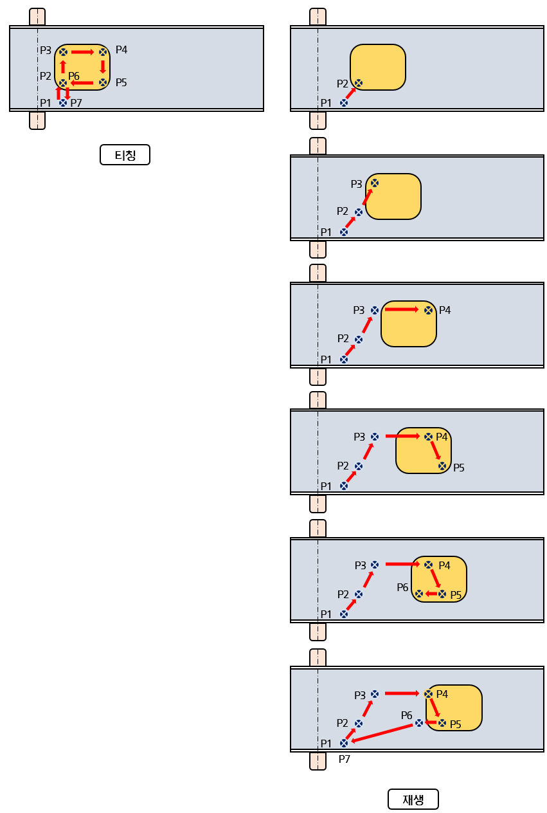

# 1.2 컨베이어 동기 원리

아래의 그림과 같이 컨베이어가 정지한 상태에서 티칭한 궤적 P1\~P7(P2\~P6 은 컨베이어 동기)을 재생시에는 컨베이어에 탑재되어 이동하는 작업물에 대해서 리밋스위치로부터 작업물이 이동한 양을 구한 후 기준(티칭) 위치에 그 양을 가산하여 재생합니다. 이를 위해서는 변동하는 컨베이어 속도에 로봇이 동기하여야 하며 작업물과 툴 간의 상대적인 위치 및 자세를 유지해야 합니다.

