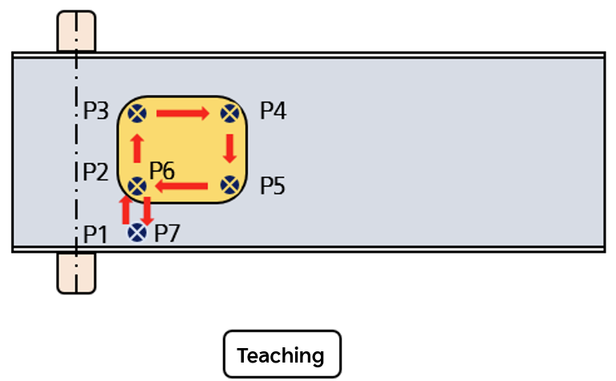
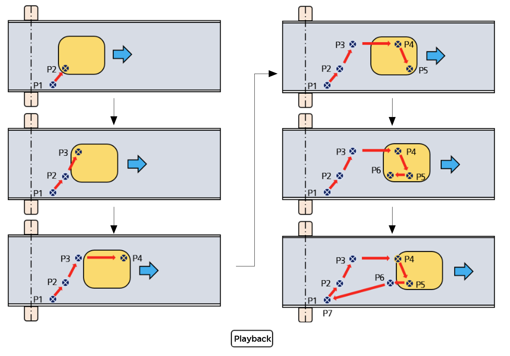

# 1.2 Conveyor Synchronization Principle

- **Teaching**

    For example, consider teaching points P1~P7 while the conveyor is stopped as shown below.

- **Playback**

    If P2~P6 are set as the conveyor synchronization section and the taught trajectory is replayed, the robot must synchronize with the varying conveyor speed and maintain the relative position and orientation between the workpiece and the tool.
    Within the sync section, the workpiece shifts from the taught reference position by the distance the workpiece moved after passing the limit switch, as shown below.

