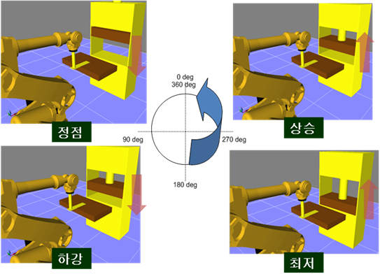

# 1.3 프레스 동기 원리

프레스는 정점에서부터 하강하여 최저점까지 이동하면서 프레스 작업을 수행합니다. 그 이후에 다시 상승하여 정점으로 이동함으로써 하나의 사이클을 이룹니다. 프레스 동기는 프레스의 위치와 로봇의 위치를 스텝 데이터에 기록함으로써 프레스의 이동 속도에 따라 로봇의 위치를 동기화 시키는 것입니다. 단 동기 성능은 로봇의 가감속, 최고속의 성능에 제한되며 프레스의 예상속도 대비 변동이 큰 경우 오차가 발생할 수 있습니다.

