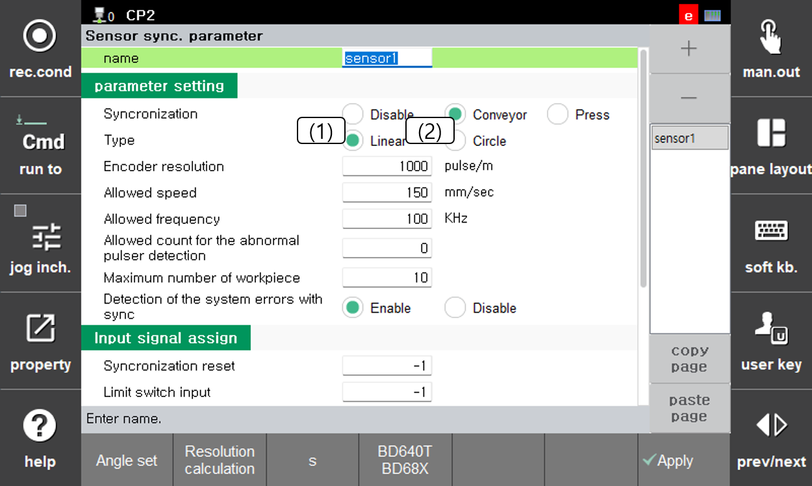

# 1.6.1. 튜토리얼 - 센서 선택과 기본 설정

### 목표와 시작 조건

이번 튜토리얼에 사용할 센서와 직선 컨베이어를 선택하고 실제 설비의 I/O 할당을 설정합니다. [튜토리얼 - 시작 전 준비](README.md)를 먼저 완료하십시오.

### 조작 순서

1. `[설정] > [응용 파라미터] > [센서 동기]` 화면을 엽니다.
2. 화면 우측 상단 `[+]`버튼을 눌러 센서를 추가합니다.
3. **동기 상태**에서 `컨베이어`, **컨베이어 형태**에서 `직선`을 선택합니다. 
4. **리밋스위치 입력**, **펄스 카운터 입력(16 bit)** 및 사용하는 기타 신호를 설정합니다. 펄스 카운터에는 16개 입력 중 시작 신호(최하위 비트의 번호)를 입력합니다. 연속된 16개 신호가 다른 용도로 중복 사용되지 않는지 확인하십시오.
5. 실제 엔코더·I/F 보드 사양에 맞게 **펄스 카운터 타입**과 **펄스 통신 방식**을 확인합니다. 배선·보드 사양을 모르면 임의로 선택하지 말고 담당자에게 확인합니다.
6. 허용 속도 등 운전 파라미터를 담당자와 확인합니다. 엔코더 분해능은 [1.6.3 각도 설정 및 엔코더 분해능 설정](3-calibration.md)에서 계산·검증합니다. 
7. 튜토리얼에서는 작업물 1개만 투입합니다. 최대 작업물 허용 개수 설정과 별개로, 추가 작업물이 들어오지 않도록 시험 조건을 준비합니다.
8. 화면의 적용·저장 조작을 완료하고 다시 열어 설정이 유지되는지 확인합니다. 


화면의 분해능·속도·신호 번호는 설명용 예시이며 이번 설비의 권장값이 아닙니다. 입력 이상이나 속도 에러를 피하려고 시스템 에러 검출을 무효로 하거나 펄스 이상 검출 허용 횟수·허용 속도를 임의로 높이지 마십시오. 원인을 먼저 점검해야 합니다.


### 완료 조건

- 리밋스위치와 펄스 카운터 신호 번호가 실제 I/O 할당 정보와 일치합니다.
- 통신 방식·카운터 타입을 실제 보드·엔코더 사양으로 확인했습니다.
- 설정을 다시 열었을 때 저장한 값이 유지됩니다.

상세 설명: [3.3 센서 동기 파라미터](../../3-user-interface/3-3-sensor-sync-parameter.md)
