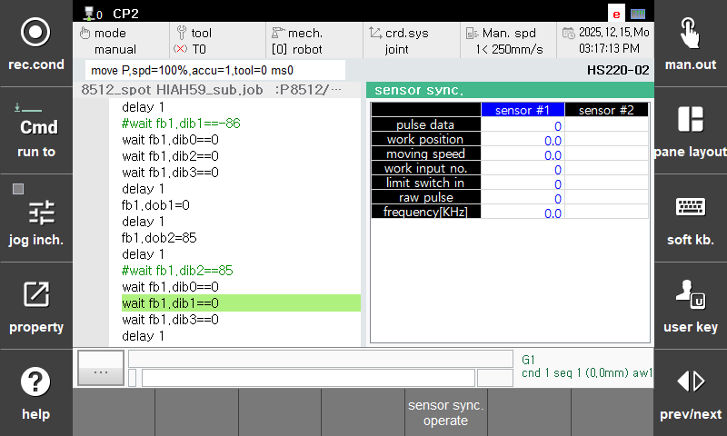

# 1.6.2 Tutorial - Checking Limit Switch and Encoder Inputs

## Objective and Prerequisites

Verify that the controller receives the workpiece detection signal and encoder pulses. Complete [Basic Settings](1-basic-settings.md), and perform these checks under safe inspection conditions approved by the personnel responsible for the equipment. Do not run the robot program.

## 1. Open the Inspection Screen

1. Open `[Monitoring] > [Sensor Synchronization]`.
2. Select the sensor used in the basic settings.
3. Check the current values of **Limit Switch Input** and **Raw Pulses**.

## 2. Check the Limit Switch

1. Verify that **Limit Switch Input** is `0` when the limit switch is not actuated.
2. Actuate the actual limit switch using a safe method approved by the personnel responsible.
3. Verify that the input changes to `1` and returns to `0` when the switch is released.

**Expected result:** The limit switch input on the screen matches the state of the actual limit switch.


The `[Actuate Limit Switch]` button on the monitoring screen and the `cv.input` command in a program manually register workpiece entry. Do not use them in this step, which checks the actual wiring. Using actual and manual inputs together may cause duplicate workpiece entries to be registered.


## 3. Check the Encoder Input

1. Verify that the equipment is in a safe state with no interference between the robot and workpiece.
2. Move the conveyor a short distance at the approved inspection speed. Do not press or hold the workpiece with your hand or a tool.
3. Verify that **Raw Pulses** consistently increase or decrease as the conveyor moves, and record the direction of change.
4. Stop the conveyor and check that the value stabilizes. Do not proceed to the next step if the value continues to change while stopped or changes irregularly during movement.

**Expected result:** The counter changes during movement and stabilizes when stopped. A transition from `ffff` to `0`, or from `0` to `ffff`, may be a wraparound of the 16-bit counter. Do not conclude that the input is abnormal based on a single change in the value.

This step only checks whether the inputs are functioning correctly. Their correspondence to the actual travel direction and distance will be checked after setting the resolution and angle.

## Completion Criteria

- The limit switch input on the screen matches the operation of the actual limit switch.
- Raw pulses change consistently as the conveyor moves.
- Raw pulses are stable when stopped, and the relationship between the travel direction and the direction of counter change has been checked.

## Symptoms and Checks

| Symptom | Check Sequence |
| --- | --- |
| Limit switch input does not change | Selected sensor → limit switch input number → corresponding input in the general I/O monitor → sensor power and wiring |
| Raw pulses do not change | Selected sensor → starting number of the 16-bit input → I/F board status and encoder connection → encoder power and output |
| The value continues to change even when stopped | Have the personnel responsible check for duplicate signal assignments, board settings, wiring, and noise |


Wiring and electrical signal checks must be performed by the personnel responsible in accordance with safety procedures.


For details, see [2.2 Hardware Inspection](../2-system-config-access/2-2-hardware-inspection.md) and [3.4 Monitoring](../3-user-interface/3-4-monitoring.md).
