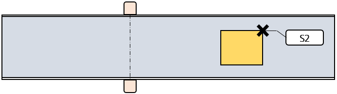
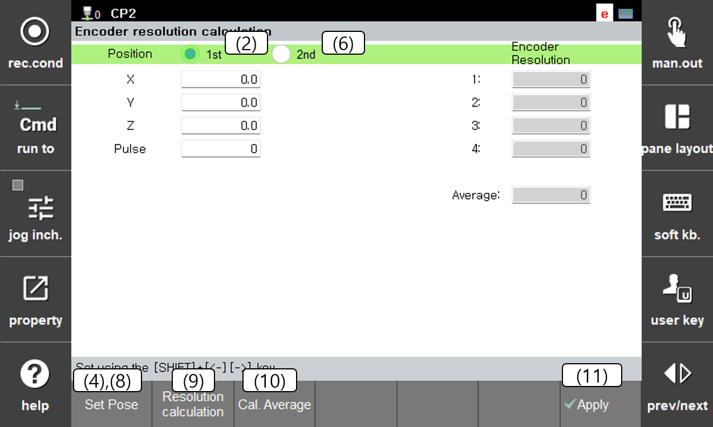

# 1.6.3 튜토리얼 - 각도 설정 및 엔코더 분해능 설정

### 목표와 시작 조건

제어기에 컨베이어의 진행 방향과 실제 이동량에 대응하는 펄스 수를 알려줍니다. [1.6.2 리밋스위치와 엔코더 입력 확인](2-check-inputs.md)을 완료한 뒤 진행하십시오.

작업물에는 반복해서 찾을 수 있는 **동일한 기준점**을 정합니다. 첫 위치와 두 번째 위치에서 다른 모서리나 다른 작업물을 사용하면 계산에 오차가 생깁니다. 측정용 툴/TCP를 확인하고, 작업물이 컨베이어 위에서 미끄러지지 않도록 준비합니다.


컨베이어를 움직일 때는 툴을 안전하게 이격하고, 컨베이어를 정지시킨 뒤 로봇을 기준점으로 이동하십시오. 작업물 기준점에 툴을 접촉한 상태로 컨베이어를 움직이지 마십시오. 안전한 공간과 로봇 도달 범위를 먼저 확보해야 합니다. 확보할 수 없으면 임의로 짧게 측정하여 합격 처리하지 말고 담당자에게 별도 측정 방법을 확인하십시오.


### 1. 컨베이어 진행 방향(각도) 계산

1. 각도 계산용 시험 프로그램을 새로 선택하고 번호를 기록합니다. 기존 작업 프로그램과 구분하십시오.
2. 컨베이어를 정지시킨 상태에서 툴 끝을 작업물의 기준점으로 이동하여 `S1`을 기록합니다.
3. 툴을 안전하게 이격한 뒤 컨베이어를 진행 방향으로 이동시키고 정지합니다.
4. **같은 작업물의 같은 기준점**으로 툴 끝을 이동하여 `S2`를 기록합니다. 두 점의 순서는 컨베이어가 진행하는 순서와 일치해야 합니다.
5. `[설정] > [응용 파라미터] > [센서 동기]`에서 사용할 센서를 선택합니다.
6. `[각도 설정] > [자동계산]`을 선택합니다.
7. `S1`, `S2`를 기록한 프로그램 번호를 입력하여 계산합니다.
8. 계산 결과를 확인하고 `[확인]`버튼을 눌러 저장합니다. 다시 화면을 열어 값이 유지되는지 확인합니다.

**확인할 것:** 프로그램 번호, 두 점의 기록 순서, 동일 기준점·툴/TCP 사용 여부, 계산 결과의 저장 여부

상세 절차: [3.1.1 프로그램 티칭](../../3-user-interface/3-1-conveyor-angle-auto-set/1-program-teaching.md), [3.1.2 자동계산 실행](../../3-user-interface/3-1-conveyor-angle-auto-set/2-auto-calculation.md)

### 2. 엔코더 분해능 계산

직선 컨베이어의 분해능 단위는 **pulse/m**입니다. 예를 들어 1 m 이동에 10000 pulse가 발생한다면 분해능은 10000 pulse/m입니다.

1. 센서 동기 파라미터 화면에서 `[해상도 계산]` 버튼을 클릭합니다.
2. 작업물이 실제 리밋스위치를 통과하게 한 뒤 컨베이어를 안전하게 정지합니다. 계산 화면에서 사용할 센서를 확인합니다.
3. 위치 `1번`을 선택합니다. 툴 끝을 작업물 기준점으로 이동하고 `[자세지정]`을 눌러 로봇 위치와 펄스를 기록합니다.
4. 툴을 안전하게 이격한 뒤 컨베이어를 작동시켜 작업물을 이동시킨 후 정지합니다.
5. 위치 `2번`을 선택합니다. 툴 끝을 **같은 작업물의 같은 기준점**으로 이동하고 `[자세지정]`을 누릅니다.
6. `[해상도 계산]`을 눌러 계산값을 기록합니다.
7. 측정을 반복(최대 4번)하여 값을 비교합니다. 각 계산값이 크게 다르면 평균값 계산 전 기준점·미끄러짐·입력 상태를 재점검합니다.
8. 유효한 측정값을 확인한 뒤 `[평균값계산]`, `[완료]` 순으로 설정을 반영합니다. 센서 동기 파라미터 화면에서 저장된 분해능을 확인하고 기록합니다.

상세 절차: [3.2 엔코더 분해능 자동설정](../../3-user-interface/3-2-encoder-resolution-auto-set.md)

### 3. 실제 이동량과 대조

1. 툴을 안전한 위치에 두고 로봇 프로그램을 정지한 상태에서 `[모니터링] > [센서 동기]`를 엽니다.
2. 실제 리밋스위치로 인식된 작업물을 사용하여, 컨베이어를 정지시킨 상태의 **작업물 위치**와 실제 기준점 위치를 기록합니다.
3. 승인된 조건으로 컨베이어를 이동시키고 정지한 뒤, 두 위치의 실제 이동 거리와 모니터의 작업물 위치 차이를 비교합니다. 이동 중 측정하지 마십시오.
4. 진행 방향에 대한 위치값 변화와 이동 거리의 대응이 맞는지 확인합니다. raw 펄스 대신 환산된 **작업물 위치(mm)** 를 비교하십시오.
5. 사전에 정한 거리 오차 기준을 만족하는지 기록합니다. 분해능 확인 전후로 **이동 속도(mm/s)** 도 실제 시험 조건과 맞는지 확인합니다.

### 완료 조건

- 각도와 분해능 계산 결과가 사용할 센서에 저장되어 있습니다.
- 실제 이동 방향과 모니터의 위치 변화가 대응합니다.
- 실제 이동 거리와 작업물 위치 변화가 사전에 정한 허용오차 안에서 일치합니다.

### 증상 및 점검 방법

원인을 확인하기 전에 값의 부호나 크기를 임의로 바꾸지 마십시오.

| 증상 | 점검 |
| --- | --- |
| 방향이 맞지 않음 | 센서 선택, `S1/S2` 순서, 카운터 타입·배선 확인 |
| 거리 비율이 맞지 않음 | 직선/원형 선택, pulse/m 단위, 기준점, 툴/TCP, 엔코더 입력 점검 |
| 정지 상태에서도 값이 계속 변함 | 신호 할당 중복, 보드 설정, 배선·노이즈 점검 |

