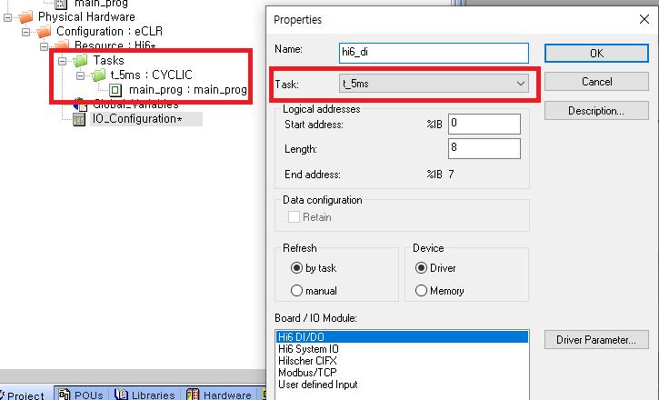
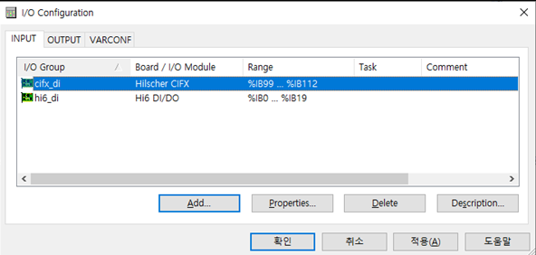
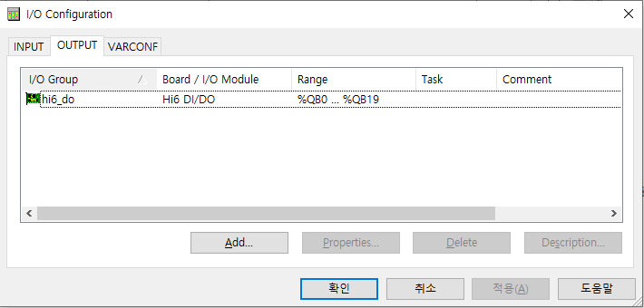
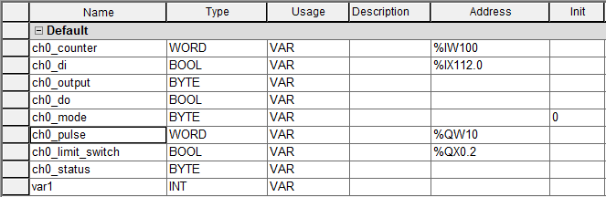

# 2.1.2 PLC 프로그램

컨베이어 I/F 보드에서 입력되는 엔코더 펄스는 내장 PLC를 통해 전달할 수 있습니다. 하기는 하나의 예제로 현장에 구성된 시스템에 맞게 조정하여 사용하십시오.


<mark style="color:red;">엔코더에서 입력되는 펄스 값을 기준으로 로봇이 이동하기 때문에 펄스 값을 읽는 주기가 일정해야 로봇의 추종 성능이 좋습니다. 따라서 PLC 로직은 5 ms  의 cyclic task 에서 수행하고 I/O configuration 을 구성할 때도 지정된 5 ms 의 task 로직에서 수행되도록 하십시오.</mark>




* <mark style="color:green;">**I/O configuration**</mark>





* <mark style="color:green;">**변수 정의**</mark>



*   <mark style="color:green;">**로직 작성**</mark>

    하기 작성된 로직은 5 ms cyclic Tasks 에서 실행되도록 하십시오.

```

ch0_pulse := ch0_counter;
ch0_limit_switch := ch0_di;
ch0_output := ch0_mode;
ch0_output.X4 := ch0_do;

```

*   I/O 카드에서 읽은 펄스카운터를 Hi6 DO(%QW10)에 write 합니다.&#x20;

    (여기서는 **\[설정 > 응용 파라미터 > 센서 동기 파라미터 설정]** 에서 “**펄스카운터 입력(16bit)**”를 di80 \~ di95 으로 설정하였다고 가정)
*   I/O 카드에서 읽은 리밋스위치 입력 상태를 Hi6 DO(%QX0.2)에 write 합니다.

    (여기서는 **\[설정 > 응용 파라미터 > 센서 동기 파라미터 설정]** 에서 “**리밋스위치 입력**”를 3 으로 설정하였다고 가정)
