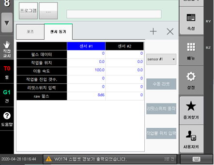

# 2.2 하드웨어 점검

**\[모니터링 > 센서 동기]**를 선택하면 선세 동기 관련 데이터를 확인할 수 있습니다.

*   <mark style="color:green;">**리밋스위치**</mark>

    “**리밋스위치 입력**” 항목은 리밋스위치가 동작중이면 1, 동작하지 않으면 0 으로 표시되면 정상입니다. 정상 동작하지 않으면 하드웨어를 점검하십시오.
*   <mark style="color:green;">**엔코더**</mark>

    “**raw 펄스”** 항목은 엔코더 펄스가 정상적으로 입력되면 컨베이어 동작 시 0 \~ ffff 범위에서 값이 계속 증가하거나 계속 감소합니다. 정상 동작하지 않으면 하드웨어를 점검하십시오.
