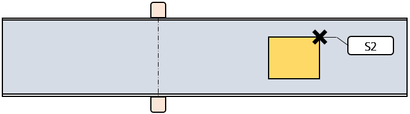
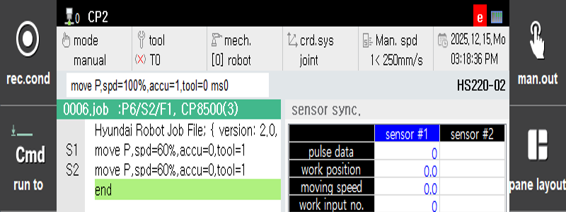

# 3.1.1 Program Teaching

To perform conveyor angle auto-calculation, first write a program as follows.

  
To set the angle accurately, make each recorded position as far apart as possible (recommended at least 1 m for straight conveyors).


1. Select a new program for conveyor angle auto-calculation.
2. Move the robot tool tip to a specific position on the conveyor workpiece and record S1.

3. Move the conveyor to shift the workpiece, move the robot tool tip to the same specific position and record S2.

4. A program similar to the following will be created.

    
For circular conveyors, three positions are required to calculate the angle. Repeat step 3 once more.  
