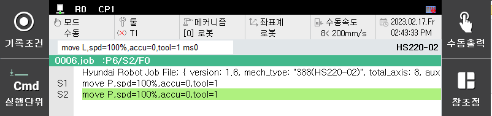

# 3.1.1 프로그램 티칭

컨베이어 각도 자동게산을 위해서 먼저 자동 계산을 위한 프로그램을 다음과 같은 방법으로 작성합니다.


컨베이어 형태가 원형인 경우 각도를 계산하기 위해서는 3 점의 위치가 필요합니다.

아래에서 3 의 과정을 한번더 해주십시오.

각도를 정확하게 설정하기 위해서는 각각의 위치를 가능한 멀게 하십시오. (직선 1 m 이상)


1\. 컨베이어 각도 자동계산을 위한 새로운 프로그램을 선택합니다.

2\. 컨베이어 상의 작업물에 대한 특정 위치로 로봇의 툴 끝을 이동한 후 S1을 기록합니다.

3\. 컨베이어를 구동하여 작업물을 이동한 후 (2)의 특정위치로 로봇의 툴 끝을 이동한 후 S2를 기록합니다.

4\. 다음의 프로그램이 작성됩니다.

