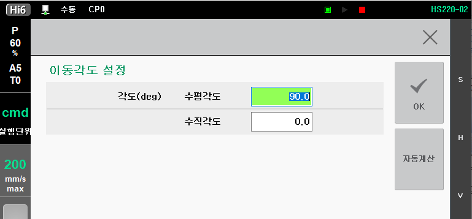
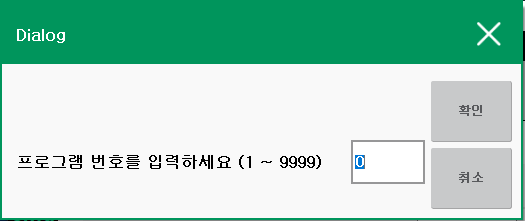

# 3.1.2 자동계산 실행

**\[설정 > 응용 파라미터 > 센서 동기]** 화면에서 **\[각도 설정]**을 누르면 다음의 화면이 표시됩니다.


컨베이어 형태가 **<원형>**으로 설정된 경우는 원형 컨베이어의 각도 및 중심 설정을 위해 아래의 내용이 변경됩니다.


1\. 현재 설정된 컨베이어 각도를 확인 및 수동으로 설정할 수 있습니다.

2\. 컨베이어 각도 자동계산을 위해서는 **\[자동계산]**을 누르면 다음의 화면이 표시됩니다. 여기서 티칭된 프로그램 번호를 입력하면 계산 결과가 표시됩니다.

3\. **\[OK]**키를 눌러서 설정된 값을 저장합니다.
