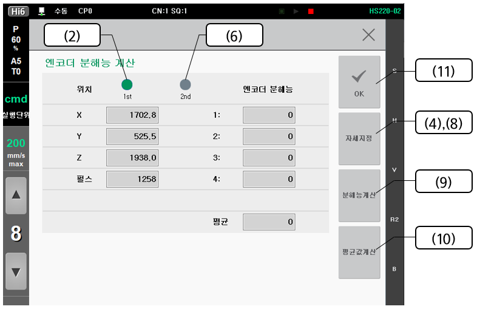
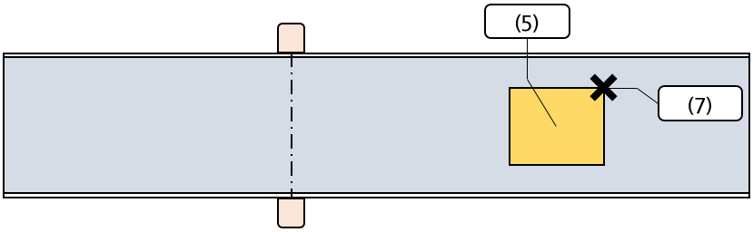

# 3.2 엔코더 분해능 자동설정

엔코더 분해능이란 컨베이어(프레스)의 형태가 직선인 경우는 컨베이어(프레스)가 1 m 이동한 경우, 원형인 경우는 컨베이어(프레스)가 1 deg 회전한 경우 발생하는 펄스 수를 의미합니다.

엔코더 분해능을 자동으로 계산하기 위해서는 **\[설정 > 응용 파라미터 > 센서 동기]** 화면에서 **\[분해능계산]**을 누릅니다.

1\. <mark style="color:blue;"></mark> 아래의 그림과 같이 작업물이 리밋스위치를 치고 들어간 후 센서를 지정합니다.

2\. 위치를 **<1st>**로 선택합니다.

3\. 작업물 위의 특정위치로 로봇의 툴 끝을 이동합니다.

4\. **\[자세지정]**을 누르면 현재 로봇의 위치와 함께 엔코 펄스 값이 기록됩니다.

5\. 아래의 그림과 같이 센서를 구동하여 작업물을 이동합니다. (1 m 이상)

6\. 위치를 **<2nd>**로 선택합니다.

7\. 3 에서 지정한 특정위치로 로봇의 툴 끝을 이동합니다.

8\. **\[자세지정]**을 누르면 현재 로봇의 위치와 함께 엔코더 펄스 값이 기록됩니다.

9\. **\[분해능계산]**을 누르면 엔코더 분해능을 계산하고 엔코더 분해능 항목에 기록합니다.

　1 \~ 9의 과정을 반복하면 총 4개의 엔코더 분해능을 계산할 수 있습니다.

10\. **\[평균값계산]**을 누르면 기록된 엔코더 분해능들의 평균 값이 계산됩니다.

11\. **\[완료]**를 누르면 평균 값이 엔코더 분해능으로 설정됩니다.
