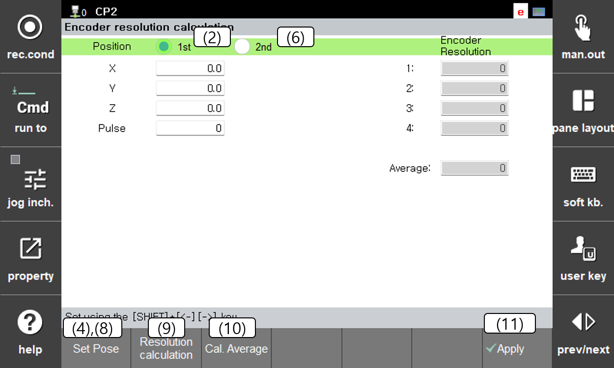
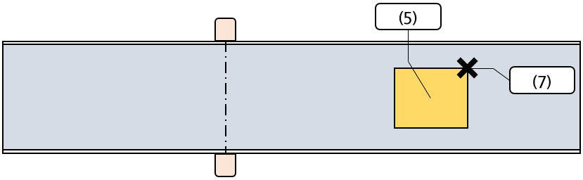

# 3.2 编码器分辨率自动设置

编码器分辨率是指当线性输送带（或压机）移动 1 m 时，或当圆形输送带（或压机）旋转 1 度时生成的脉冲数。

要自动计算编码器分辨率，请转到 [Settings > Application Parameters > Sensor Sync] 并按 [Resolution Calculation]。

1. 在工件触发限位开关后，如下所示指定传感器。

2. 选择位置 <1>。
3. 将机器人工具尖端移动到工件上的特定位置。
4. 按 [Record Pose] 记录当前机器人姿态和编码器脉冲值。
5. 按照所示操作传感器移动工件（至少 1 m）。

6. 选择位置 <2>。
7. 将机器人工具尖端移回步骤 3 中记录的特定位置。
8. 按 [Record Pose] 记录姿态和编码器脉冲值。
9. 按 [Calculate Resolution] 计算编码器分辨率并将其记录在编码器分辨率字段中。

重复步骤 1~9 以计算最多四个编码器分辨率。

10. 按 [Calculate Average] 计算记录的编码器分辨率的平均值。
11. 按 [OK] 将平均值设为编码器分辨率。