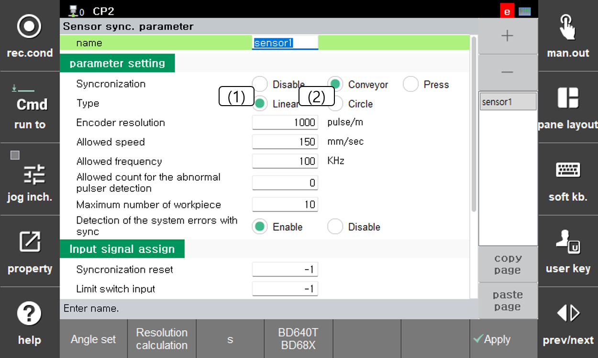
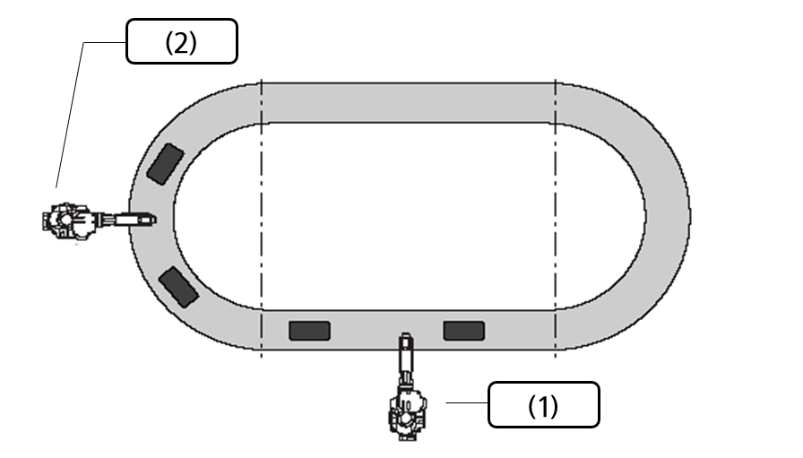
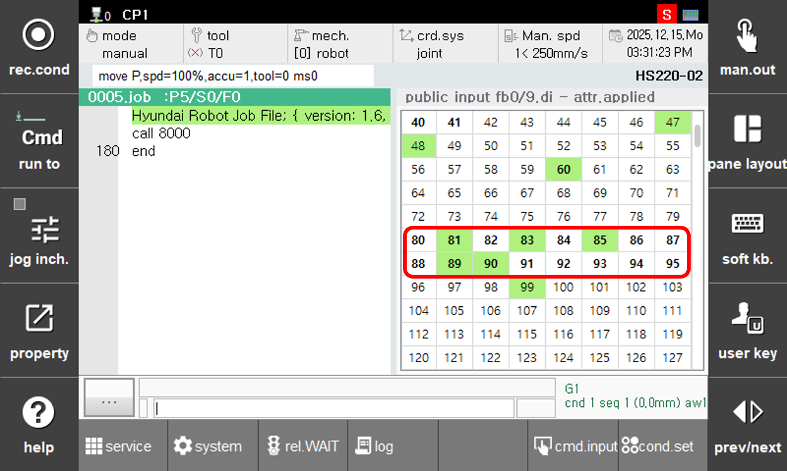

# 3.3 传感器同步参数

为了应用输送机（压力机）同步和执行机器人动作，机器人控制器必须了解与之同步的输送机（压力机）的各种信息。这些参数必须在编写操作程序之前设置。

- **输送机形式**

    根据下图选择形式。

- **编码器分辨率**

    编码器分辨率定义为线性输送机移动 1 米或圆形输送机旋转 1 度时产生的脉冲数量。


有关自动编码器分辨率计算，请参阅[3.2 编码器分辨率自动设置](3-2-encoder-resolution-auto-set.md)部分。


- **输送机允许速度**

    此参数用于将异常高的速度视为错误。根据预期操作速度进行配置；控制器会内部计算输送机速度，并在速度超过配置的允许速度时报告错误。

  
编码器脉冲通常围绕其平均值有波动，因此速度也会显现出轻微的波动。将允许速度设定得稍高一些以适应这一点。


- **脉冲异常检测的允许计数**

    如果脉冲输入异常，机器人控制器会输出错误“E0019 输送机脉冲允许频率超出”。配置此项以允许机器人在同步操作期间容忍一定数量的脉冲异常，从而继续工作（保护工件）。

  
例如，如果允许的脉冲异常检测次数设置为 3，机器人控制器即使在同步操作期间对单个工件检测到多达三次脉冲异常，也不会产生错误，而是内部生成适当的脉冲值。当检测到第四个脉冲异常时，将生成错误。检测到的脉冲异常次数信息在对应工件的回放完成时重置。
  

- **允许的最大工件数量**

    配置当另一个工件触发限制开关并在机器人同步一个工件时进入工作空间时，机器人是否应继续工作。允许的最大值为 100。

- **检测与同步相关的系统错误**

    如果系统安装不完整或板损坏，导致阻止切换到 RUN READY 的与同步相关的系统错误，请配置以忽略与同步相关的系统错误，以便可以继续不相关的操作。

| **错误编号** | **同步系统错误类型** |
| :-----------: | ------------------------- |
| E0021 | 输送机允许速度超出 |

- **同步复位输入**

    外部输入可以清除输送机（压力机）数据。当此信号在机器人停止时输入时，传感器相关数据（脉冲数据、工件位置、速度、工件数量、同步回放状态等）被清除，相当于手动复位。

- **限位开关输入**

    通过外部输入接受限位开关状态。

- **脉冲计数器输入**

    通过外部输入接受编码器脉冲计数器。控制器将脉冲计数器内部管理为 16 位数据，因此使用 1 字（2 字节）输入信号。指定最低位信号编号会自动分配 16 个连续信号。

- **脉冲线错误**

    使用线驱动脉冲通信时，可以检测脉冲线上的开路。使用此功能将脉冲线错误报告给机器人控制器。

- **输送机同步 ON**

    输送机同步状态可以外部输出。当命令 **"cv.sync start"** 运行并且同步处于 ON 时，输出 **"1"**。

- **脉冲计数器类型**

    当输送机向前移动时，脉冲值增加。如果在后退时脉冲增加，则为“上”类型；如果减少，则使用“上下”类型。通常使用“上下”。在我们的板上，“上”被输出为关闭，而“上下”被输出为打开。

- **脉冲通信类型**

    典型的脉冲通信使用开集电极和线驱动。有关详细信息，请参阅单独的学习材料。在我们的板上，“线驱动”被输出为关闭，而“开集电极”被输出为打开。