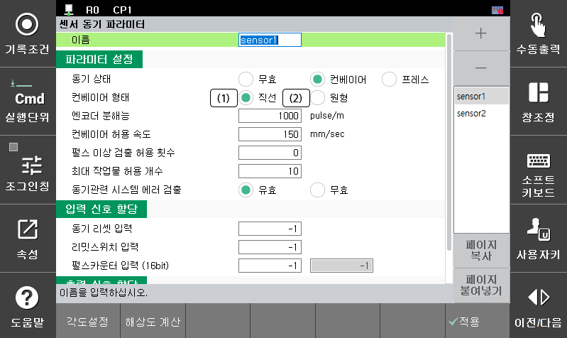

# 3.3 센서 동기 파라미터

컨베이어(프레스) 동기 기능을 적용하여 로봇을 재생시키기 위해서는 로봇 제어기가 동기해야 할 컨베이어(프레스)에 대한 각종 정보를 알고 있어야 하는데, 이 정보는 작업 프로그램을 작성하기 전에 반드시 설정되어야 합니다.

*   <mark style="color:green;">**컨베이어 형태**</mark>

    아래의 그림을 참고하여 형태를 선택합니다.

*   <mark style="color:green;">**엔코더 분해능**</mark>

    엔코더 분해능이란 컨베이어 형태가 직선인 경우는 컨베이어가 1 m 이동한 경우, 원형인 경우는 컨베이어가 1 deg 회전한 경우 발생하는 펄스 수 로 정의됩니다.


엔코더 분해능을 자동으로 계산하기 위해서는 “[**3.2 엔코더 분해능 자동설정**](3-2-encoder-resolution-auto-set.md)” 부분을 참고하십시오.


*   <mark style="color:green;">**컨베이어 허용 속도**</mark>

    비정상적으로 속도가 높을 경우 이를 에러로 처리하기 위한 항목입니다. 사용할 속도를 고려하여 설정하면 제어기는 컨베이어의 속도를 내부적으로 계산하여 그 속도가 설정된 허용속도보다 높은 경우 에를 출력합니다.


일반적으로 엔코더 펄스는 평균 값을 중심으로 ripple이 있기 때문에 속도도 평균 값을 기준으로 약간 ripple 이 있습니다. 따라서 이를 고려하여 약간 높은 값을 설정하십시오.


*   <mark style="color:green;">**펄스 이상 검출 허용 횟수**</mark>

    펄스가 비정상적으로 입력되는 경우 로봇 제어기는 "**E0019 컨베이어 펄스 허용주파수 초과**" 에러를 출력합니다. 이때 동기 작업중인 작업물의 보호를 위해 펄스 에러가 발생하더라도 로봇이 작업을 계속하도록 하는 경우 설정합니다.


예를 들어, 펄스 이상 검출 허용 횟수가 3 으로 설정되면 로봇제어기는 동기 작업중 하나의 작업물에 대해 펄스이상을 3 회까지 검출하더라도 에러를 발생시키지 않고 내부적으로 적당한 펄스 값을 만들어줍니다. 이후 4 번째 펄스 이상이 검출되면 에러를 발생시킵니다. 발생한 펄스 이상 횟수에 대한 정보는 해당 작업물에 대한 재생이 완료될  때 초기화 됩니다.


*   <mark style="color:green;">**최대 작업물 허용 개수**</mark>

    로봇이 컨베이어 상의 하나의 작업물에 대해 동기 작업 중 다른 작업물이 리밋스위치를 치고 작업공간 내에 진입했을 때 이에 대한 작업 여부를 설정합니다. 작업물 진입 최대 허용 개수는 100 개까지 가능합니다.

*   <mark style="color:green;">**동기관련 시스템 에러 검출**</mark>

    시스템 설치 미완료 또는 보드 파손등의 원인으로 컨베이어 동기와 관련된 시스템 에러가 발생하여 로봇을 운전준비 ON 시킬 수 없는 경우, 동기작업과 관계없는 동작을 하기위해 컨베이어 동기와 관련된 시스템 에러를 발생시키지 않도록 설정합니다.

| **에러번호** | 　　　　　　　**동기 시스템 에러의 종류** |
| :------: | ------------------------ |
|   E0021  | 컨베이어 허용 속도 초과            |

*   <mark style="color:green;">**동기 리셋 입력**</mark>

    외부 입력 신호에 의해 컨베이어(프레스) 데이터를 클리어 할 수 있습니다. 로봇이 정지상태 일 때 이 신호가 입력되면 센서 관련 각종 데이터(펄스 데이터, 작업물 위치, 이동 속도, 작업물 진입 개수, 동기 재생 상태 등)를 클리어 합니다. 즉, 수동 리셋을 수행한 것과 동일하게 처리됩니다.

*   <mark style="color:green;">**리밋스위치 입력**</mark>

    외부 입력 신호에 의해 리밋스위치 상태를 받을 수 있습니다.

*   <mark style="color:green;">**펄스 카운터 입력**</mark>

    외부 입력 신호에 의해 엔코더 펄스 카운터를 수신할 수 있습니다. 펄스 카운터는 제어기 내부적으로 16 bit 데이터로 관리되기 때문에 1 word (2 byte)의 입력 신호가 사용됩니다. 최하위 비트의 신호 번호를 입력하면 자동으로 16 개의 신호가 지정되어 사용하게 됩니다.

*   <mark style="color:green;">**컨베이어 동기 ON**</mark>

    출력 신호에 의해 컨베이어 동기 상태를 외부로 전달할 수 있습니다. “**cv.sync start**” 명령문이 실행되어 동기 on 상태가 되면 “**1**”을 출력합니다.
