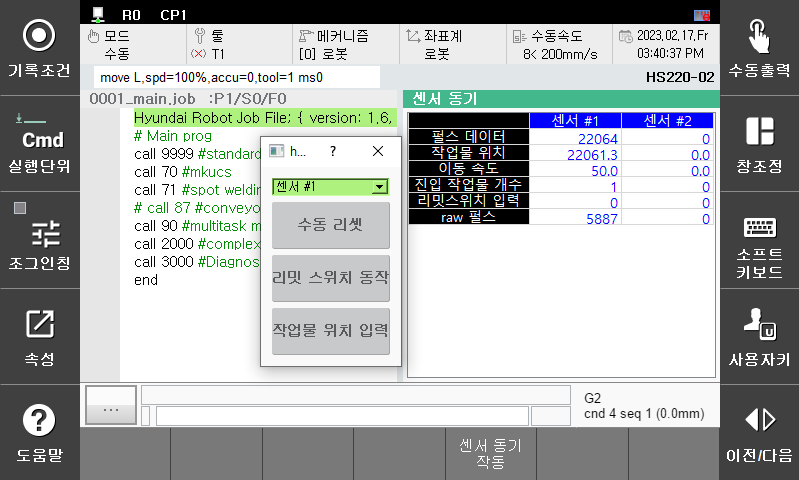

# 3.4 모니터링

**\[모니터링 > 센서 동기]**를 선택하면 센서 동기 관련 데이러를 확인할 수 있습니다.

*   <mark style="color:green;">**펄스 데이터**</mark>

    작업물이 리밋스위치로부터 카운터 된 펄스 수입니다.

*   <mark style="color:green;">**작업물 위치**</mark>

    작업물이 리밋스위치로부터 이동한 거리입니다.&#x20;

    형태가 **<직선>**인 경우 mm이며 **<원형>**인 경우는 deg의 값입니다.

*   <mark style="color:green;">**이동 속도**</mark>

    컨베이어(프레스)가 진행하는 속도입니다.

    형태가 **<직선>**인 경우 mm/s이며 **<원형>**인 경우는 deg/s의 값입니다.

    &#x20;
*   <mark style="color:green;">**진입 작업물 개수**</mark>

    작업물이 리밋스위치를 치고 진입된 개수입니다.

    &#x20;
*   <mark style="color:green;">**리밋스위치 입력**</mark>

    리밋스위치가 동작중인지 상태를 표시합니다.

    &#x20;
*   &#x20;<mark style="color:green;"></mark> <mark style="color:green;"></mark><mark style="color:green;">**raw 펄스**</mark>

    입력되는 엔코더 펄스의 값을 hex 데이터로 표시합니다. 정상인 경우 0 \~ ffff까지 반복합니다.

    ****
*   <mark style="color:green;">**수동 리셋**</mark>

    센서 관련 각종 데이터(펄스 데이터, 작업물 위치, 이동 속도, 작업물 진입 개수, 동기재생 상태 등)을 수동으로 클리어 합니다.

    &#x20;
*   <mark style="color:green;">**작업물위치 입력**</mark>

    센서 위치값(직선 mm, 원형 deg)을 수동으로 입력합니다.

    &#x20;
*   <mark style="color:green;">**리밋스위치 동작**</mark>

    리밋 스위치를 수동으로 입력할 필요가 있는 경우 사용합니다.
