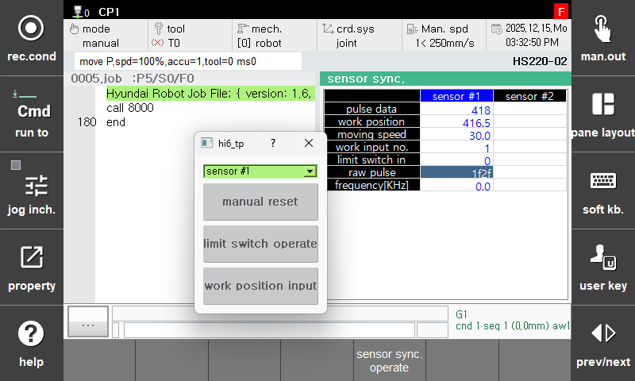

# 3.4 监控

选择 **[监控 > 传感器同步]** 查看与传感器同步相关的数据。使用 **[传感器同步. 操作]** 按钮执行各种操作。

- **脉冲数据**

    自限位开关以来计数的工件脉冲数。

- **工件位置**

    工件从限位开关移动的距离。对于 <linear> 形式，以毫米为单位；对于 <circular> 形式，以度为单位。

- **速度**

    输送带（或压机）的移动速度。对于 <linear> 形式，以毫米/秒为单位；对于 <circular> 形式，以度/秒为单位。

- **已输入的工件数量**

    触发限位开关并进入的工件数量。

- **限位开关输入**

    显示限位开关是否处于活动状态。

- **原始脉冲**

    在正常操作期间，以十六进制数据（0~ffff）显示编码器脉冲计数器值。

- **手动重置**

    手动清除传感器相关数据（脉冲数据、工件位置、速度、工件数量、同步播放状态等）。

- **输入工件位置**

    手动输入传感器位置值（线性以毫米为单位，圆形以度为单位）。

- **限位开关操作**

    当需要手动切换限位开关时使用。