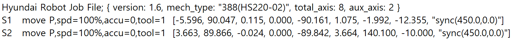
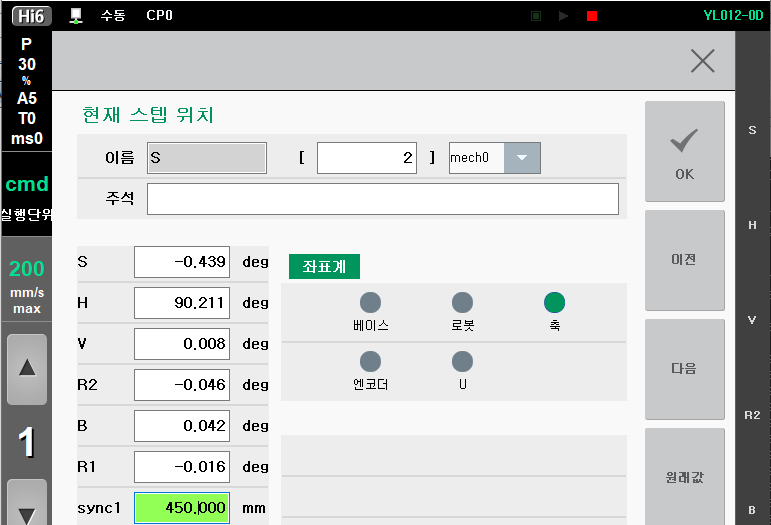

# 3.5 스텝 데이터

센서 동기가 **<유효>**로 설정된 상태에서 **\[기록]** 버튼에 의해 현재 위치를 기록하면 하기와 같이 로봇의 축 위치와 함께 현재 작업물의 위치가 기록됩니다.

로봇은 컨베이어 동기 재생 시 기록된 위치 데이터를 참조하여 이동합니다.

현재 스텝 위치에서 sync 항목에서 해당 스텝에 기록된 작업물의 위치를 확인하고 수정할 수도 있습니다.

