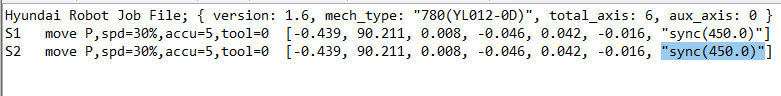
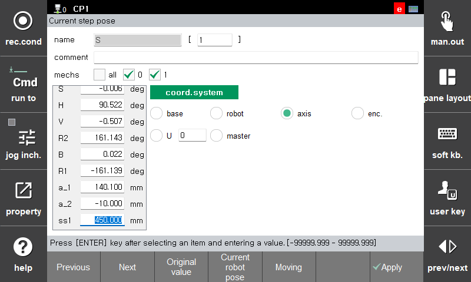

# 3.5 Step Data

When sensor sync is set to <enabled> and you press [Record], the current robot axis positions along with the current workpiece position are recorded as shown below.

The robot uses the recorded position data during conveyor sync playback.

You can view and edit the recorded workpiece position in the ss# field of the current step position properties.

