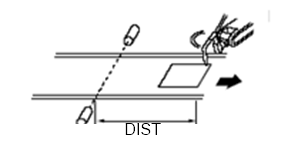

# 3.6 명령어

*   <mark style="color:green;">**cv.sync (동기 재생)**</mark>

    ### 설명

    프로그램 재생 시에 센서 동기를 실행할 구간을 지정합니다.

    ### 문법

    ```python
    cv.sync <동기동작>
    ```

    ### 파라미터
    <table>
    <thead>
        <tr>
        <th style="text-align:left">항목</th>
        <th style="text-align:left">의미</th>
        <th style="text-align:left">기타</th>
        </tr>
    </thead>
    <tbody>
        <tr>
        <td style="text-align:left">동기동작</td>
        <td style="text-align:left">
            - reset: 동기 리셋(동기 Off + 컨베이어 데이터 클리어)<br>
            - start: 동기 시작(동기 On)<br>
            - hold: 동기 일시 중지(동기 Off)<br>
            - end: 동기 종료(동기 Off + 다음 작업물 데이터 로딩)<br>
        </td>
        <td style="text-align:left">문자열</td>
        </tr>
    </tbody>
    </table>


*   <mark style="color:green;">**cv.wait (인터록 대기)**</mark>

    ### 설명

    다음의 그림과 같이 작업물이 리밋스위치로부터 지정된 위치에 도달할 때까지 로봇을 대기할 때 사용합니다.

    

    ```python
    cv.wait posi=<대기거리>,sync=<동기여부>
    ```

    <table>
    <thead>
        <tr>
        <th style="text-align:left">항목</th>
        <th style="text-align:left">의미</th>
        <th style="text-align:left">기타</th>
        </tr>
    </thead>
    <tbody>
        <tr>
        <td style="text-align:left">대기거리</td>
        <td style="text-align:left">
            리밋스위치로부터 작업물 도달 거리
        </td>
        <td style="text-align:left">변수</td>
        </tr>
        <tr>
        <td style="text-align:left">동기여부</td>
        <td style="text-align:left">
            - 0: 비동기<br>
            - 1: 동기(프레스인 경우 미지원)<br>
        </td>
        <td style="text-align:left">변수</td>
        </tr>
    </tbody>
    </table>

*   <mark style="color:green;">**cv.input (작업물 진입)**</mark>

    ### 설명

    리밋스위치가 동작하여 작업물이 1 개 진입된 것으로 인식하고자 할 때 사용합니다.

    ```
    cv.input
    ```

    ### 사용 예

    ```python
        global cv
        cv=sync.Sensor(1)
        cv.sync reset
    S1  move P,spd=100%,accu=1,tool=1 
    S2  move P,spd=30%,accu=5,tool=1  
        delay 0.5
        cv.input
        cv.sync start
        cv.wait posi=200,sync=off
    S3  move L,spd=30%,accu=1,tool=1  
        delay 1
    S4  move L,spd=30%,accu=1,tool=1  
        delay 1
    S5  move L,spd=30%,accu=1,tool=1  
        delay 1
    S6  move L,spd=30%,accu=1,tool=1  
        delay 3
        cv.sync hold
    S7  move P,spd=100%,accu=1,tool=1  
        cv.sync end
        end
      ```