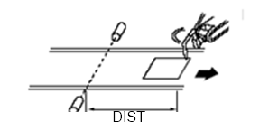

# 3.6 명령어

*   <mark style="color:green;">**cv.sync (동기 재생)**</mark>

    프로그램 재생 시에 센서 동기를 실행할 구간을 지정합니다.

```
cv.sync <동기여부>
```

| **<동기여부>** | 　　　　　　　　　　　　**내용**            |
| :--------: | ----------------------------- |
|    reset   | 동기 리셋(동기 Off + 컨베이어 데이터 클리어)  |
|    start   | 동기 시작(동기 On)                  |
|    hold    | 동기 일시 중지(동기 Off)              |
|     end    | 동기 종료(동기 Off + 다음 작업물 데이터 로딩) |

<mark style="color:green;">****</mark>

*   <mark style="color:green;">**cv.wait (인터록 대기)**</mark>

    다음의 그림과 같이 작업물이 리밋스위치로부터 지정된 위치에 도달할 때까지 로봇을 대기할 때 사용합니다.



```
cv.wait posi=<대기거리>,sync=<동기여부>
```

|    ****    | 　　　　　　　　　　　　**내용**                                                                        |
| :--------: | ----------------------------------------------------------------------------------------- |
| **<동기여부>** | <p>대기하는 동안 센서 동기 여부</p><ul><li>0 = 비동기</li><li>1 = 동기 </li><li>*프레스인 경우 비동기만 지원</li></ul> |
| **<대기거리>** | 리밋스위치로부터 작업물 도달 거리                                                                        |

<mark style="color:green;">****</mark>

*   <mark style="color:green;">**cv.input (작업물 진입)**</mark>

    리밋스위치가 동작하여 작업물이 1 개 진입된 것으로 인식하고자 할 때 사용합니다.

```
cv.input
```
