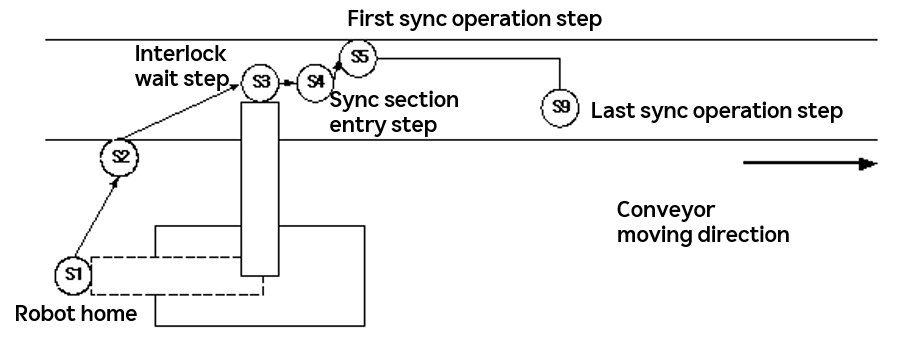

# 4.1 Sync Operation Program Structure

- **Home position wait**

    The robot waits at its home position until a start command is input.

- **Interlock wait**

    The robot moves near the synchronization section and waits until the workpiece reaches the distance recorded by `cv.wait`.

The following figure shows a painting program for workpieces flowing on a conveyor. The robot starts conveyor sync when advancing to step S4 and begins spraying paint in sync from step S5. The interlock wait step (S3) is recorded near the sync section entry step (S4).



Example program:

```python
    global cv
    cv = sync.Sensor(1)
    cv.sync reset               # Conveyor sync reset
S1                              # Robot home
S2
S3                             # Interlock wait step
    cv.sync on                 # Start conveyor sync
    cv.wait posi=500,sync=0    # Conveyor interlock wait
S4                             # Sync section entry step
    do1 = 1                    # Paint spray ON signal
S5                             # First sync operation step
 :
S9                             # Last sync operation step
    do1 = 0                    # Paint spray OFF signal
    cv.sync off                # End conveyor sync
                                # Complete current work
S10
 :
S13                            # Robot home
    end
```

- **Sync playback**

    In the figure, the conveyor sync playback section refers to steps S4 through S9; all commands in this section are executed synchronized to the moving conveyor.

- **Return to home position**

    After finishing the operation, the robot returns to its home position for the next start command.
